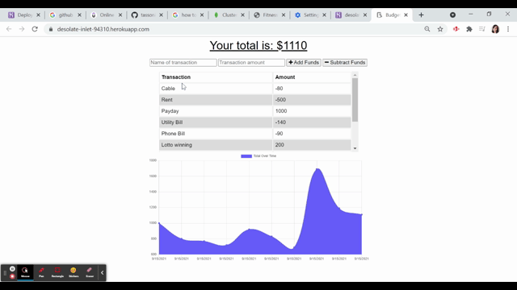

# Budget Tracker
  

  Table of Contents |
  ----------------- |
  [Description](#description) |
  [Usage](#usage) |
  [License](#license) |
  [Contributions](#contributions) |
  [Questions](#questions) |

  ## Description
  This is a budget tracking application that allows users to enter and keep track of transactions and view their transaction data on a graph. This app functions both with and without an internet connection by using a service worker to cache data, and indexDB to capture new transaction data when offline.

  ## Usage
  Link to deployed app:  https://desolate-inlet-94310.herokuapp.com/

  Demo:

  

  ## License 
  This application is licensed under MIT open-source licensing.

  ## Contributions
  Contributors: Emily Tassoni

  If you wish to contribute, please contact the email below. You may fork this repository to use for testing purposes. Thank you!

  ## Questions
   Please contact [emilyjtassoni](mailto:emilyjtassoni) with questions. 
   Visit my [GitHub](https://github.com/tassoni13) to see past and current projects.
